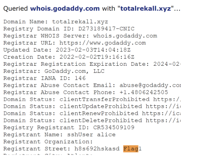
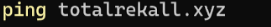



|**Vulnerability 8**|**Findings**|
| :-: | :-: |
|**Title**|Open Source Exposed Data|
|**Type (Web app / Linux OS / WIndows OS)**|
Linux OS

|
|**Risk Rating**|High|
|**Description**|Found at DomainDossier on centralops.net. Utilized an open-source intelligence (OSINT) to find where sensitive info was exposed in the WHOIS data.|
|**Images**|

Flag 1: h8s692hskasd 
|
|**Affected Hosts**|TotalRekall.xyz|
|**Remediation** |Domains must be registered privately to avoid sensitive information from being exposed in domain registries.|

|**Vulnerability 9**|**Findings**|
| :-: | :-: |
|**Title**|Pinging |
|**Type (Web app / Linux OS / WIndows OS)**|
Linux OS

|
|**Risk Rating**|Low|
|**Description**|The IP is from totalrekall.xyz which is the flag for this.|
|**Images**|
Ping totalrekall.xyz

Flag 2: 15.197.148.33
|
|**Affected Hosts**|TotalRekall.xyz|
|**Remediation** |Have servers limit the info provided when responding to network diagnostic commands, such as ping.|

|**Vulnerability 10**|**Findings**|
| :-: | :-: |
|**Title**|SSL and CRT Information|
|**Type (Web app / Linux OS / WIndows OS)**|Linux OS|
|**Risk Rating**|Medium|
|**Description**|Found at crt.sh. Open source data found through SSL info and crt.sh. This subdomain is exposed to the public and could provide attackers with information for potential attacks.|
|**Images**|Flag 3: s7euwehd.totalrekall.xyz|
|**Affected Hosts**|TotalRekall.xyz|
|**Remediation** |Limit the publication of DNS records.|

|**Vulnerability 11**|**Findings**|
| :-: | :-: |
|**Title**|NMap Scan|
|**Type (Web app / Linux OS / WIndows OS)**|Linux OS|
|**Risk Rating**|Critical|
|**Description**|We nmap scan 192.168.13.0/24 and find 5 hosts|
|**Images**|Flag 4: 5 hosts (the flag is 5)|
|**Affected Hosts**|
192\.168.13.10

192\.168.13.11

192\.168.13.12

192\.168.13.13

192\.168.13.14
|
|**Remediation** |IP blocking for unauthorized users|

|**Vulnerability 12**|**Findings**|
| :-: | :-: |
|**Title**|Aggressive Nmap Scan|
|**Type (Web app / Linux OS / WIndows OS)**|Linux OS|
|**Risk Rating**|Critical|
|**Description**|Below we can see that Drupal is the vulnerability for 192.168.13.13 (The flag is 192.168.13.13). Ran an aggressive Nmap scan to discover which host was running Drupal.|
|**Images**|

Flag 5: 192.168.13.13
|
|**Affected Hosts**|192\.168.13.13|
|**Remediation** |Block Probes|

|**Vulnerability 13**|**Findings**|
| :-: | :-: |
|**Title**|Nessus Scan|
|**Type (Web app / Linux OS / WIndows OS)**|Linux OS|
|**Risk Rating**|Medium|
|**Description**|The ID of the vulnerability from the Nessus scan for 192.168.13.12 is 97610.|
|**Images**|

Flag 6: 97610 
|
|**Affected Hosts**|192\.168.13.12|
|**Remediation** |Update and patch software on a regular basis. Always monitor for new vulnerabilities.|

|**Vulnerability 14**|**Findings**|
| :-: | :-: |
|**Title**|Apache Struts 2.3.5-2.3.31/2.5x<2.5.10.1 Jakarta Multipart parser RCE (remote)|
|**Type (Web app / Linux OS / WIndows OS)**|Linux OS|
|**Risk Rating**|Critical|
|**Description**|We ran a Nessus scan, found that Apache Tomcat Remote Code Execution is a vulnerability. RCE exploits can be used for attackers to run programs and exfiltrate data.|
|**Images**|

Flag 7: 8ks6sbhss
|
|**Affected Hosts**|192\.168.13.10 |
|**Remediation** |Upgrade Apache Struts|

|**Vulnerability 15** |**Findings**|
| :-: | :-: |
|**Title**|Nessus Scan Struts Vulnerability|
|**Type (Web app / Linux OS / WIndows OS)**|Web App|
|**Risk Rating**|High|
|**Description**|We use a struts vulnerability, found with Nessus scan, used metasploit to exploit struts2\_content\_type\_ognl|
|**Images**|

Flag 10: wjasdufsdkg 
|
|**Affected Hosts**|192\.168.13.12|
|**Remediation** |Update Apache|

|**Vulnerability 16**|**Findings**|
| :-: | :-: |
|**Title**|Drupal CVE-2019-6340|
|**Type (Web app / Linux OS / WIndows OS)**|Linux OS|
|**Risk Rating**|High|
|**Description**|Exploited drupal\_retws\_unserialize on metasploit, run command getiud to attain username on Meterpreter session. The Drupal vulnerability CVE-2019-6340 can be exploited to attain unauthorized access to user data.|
|**Images**|

Flag 11: www-data
|
|**Affected Hosts**|192\.168.13.13|
|**Remediation** |Update Drupal on a regular basis.|

|**Vulnerability 17**|**Findings**|
| :-: | :-: |
|**Title**|CVE-2019-14287|
|**Type (Web app / Linux OS / WIndows OS)**|Linux OS|
|**Risk Rating**||
|**Description**|Ssh into the server, use the password ‘alice’ and performed privilege escalation to obtain the flag using a sudo vulnerability (CVE-2019-14287): sudo-u#-1 cat /root/flag12.txt. |
|**Images**|

Flag 12: d7sdfksdf384
|
|**Affected Hosts**|192\.168.13.14|
|**Remediation** |Update sudo on a regular basis, sudo permissions restricted, always use secure passwords, never share or post passwords.|

