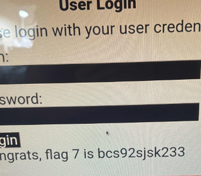

CTF Day 1: 

|**Vulnerability  18**|**Findings**|
| :-: | :-: |
|**Title**|Cross Site Scripting XSS|
|**Type (Web app / Linux OS / WIndows OS)**|Web App|
|**Risk Rating**|Critical|
|**Description**|Using  we are able to attain the flag. We can insert scripts into the input fields and bypass the input validation settings. By doing so, we could potentially insert scripts that redirect users to a spoofed web page to steal their data.|
|**Images**||
|**Affected Hosts**|Totalrekall.xyz|
|**Remediation** |Output Encoding, HTML Sanitization |

|**Vulnerability 19**|**Findings**|
| :-: | :-: |
|**Title**|Cross Site Scripting XSS #2|
|**Type (Web app / Linux OS / WIndows OS)**|Web App|
|**Risk Rating**|Critical|
|**Description**| we got a pop-up to attain flag 3. We can insert scripts into the input fields and bypass the input validation settings. By doing so, we could potentially insert scripts that redirect users to a spoofed web page to steal their data. In addition, it could be used to gain unauthorized entry.|
|**Images**||
|**Affected Hosts**|Totalrekall.xyz|
|**Remediation** |Output Encoding, HTML Sanitization |

|**Vulnerability 21**|**Findings**|
| :-: | :-: |
|**Title**|Local File Inclusion|
|**Type (Web app / Linux OS / WIndows OS)**|Web App|
|**Risk Rating**|Critical|
|**Description**|Created a PHP script file and uploaded it into the upload file of the Memory Planner section. Allowing .php files to be uploaded can result in malicious scripts being ran again the database to modify/delete data.|
|**Images**||
|**Affected Hosts**|TotalRekall.xyz|
|**Remediation** |Restrict certain file types from being uploaded|

|**Vulnerability 22**|**Findings**|
| :-: | :-: |
|**Title**|Local File Inclusion #2|
|**Type (Web app / Linux OS / WIndows OS)**|Web App|
|**Risk Rating**|Critical|
|**Description**|Created a PHP script file and uploaded it into the upload file of the Memory Planner section. Allowing .php files to be uploaded can result in malicious scripts being ran again the database to modify/delete data.|
|**Images**||
|**Affected Hosts**|TotalRekall.xyz|
|**Remediation** |Restrict certain file types from being uploaded|

|**Vulnerability 23**|**Findings**|
| :-: | :-: |
|**Title**|SQL Injection|
|**Type (Web app / Linux OS / WIndows OS)**|Web App|
|**Risk Rating**|Critical|
|**Description**|Using a basic SQL Injection: ' or '1'='1   ' or '1'='1 for user and pass we’re able to log in and capture the flag.|
|**Images**|

Flag 7: bcs92sjsk233
|
|**Affected Hosts**|TotalRekall.xyz |
|**Remediation** |Input validation|

|**Vulnerability 24**|**Findings**|
| :-: | :-: |
|**Title**|Command Injection|
|**Type (Web app / Linux OS / WIndows OS)**|Web App|
|**Risk Rating**|Critical|
|**Description**|Found username and password within HTML file of user “dougquaid” and password “kuato”. We used these credentials to log in as an administrator and found the location of more sensitive data in vendors.txt. This log-in is also vulnerable to SQL injections.|
|**Images**||
|**Affected Hosts**|TotalRekall.xyz|
|**Remediation** |Delete sensitive data from files, limit use of command execution functions.|

