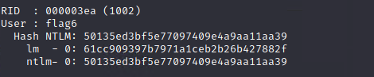

CTF Day 3: Windows Servers

|**Vulnerability 1**|**Findings**|
| :-: | :-: |
|**Title**|Unprotected User Credentials|
|**Type (Web app / Linux OS / WIndows OS)**|Web App|
|**Risk Rating**|Critical|
|**Description**|Repository had user credentials, so we used John the Ripper to crack the hash. Found the flag on totalrekall GitHub in the xampp.users page. |
|**Images**|

Flag 1: Tanya4Life
|
|**Affected Hosts**|TotalRekall Web-Server|
|**Remediation**|Remove User Credentials from Github (Or any Open-Source places)|

|**Vulnerability 2**|**Findings**|
| :-: | :-: |
|**Title**|Nmap Scan |
|**Type (Web app / Linux OS / WIndows OS)**|Web App|
|**Risk Rating**|Critical|
|**Description**|
Access IP address 172.22.117.20 on browser, use the user credentials from Flag 1 (Trivera and Tanya4Life) to log in, click on flag2.txt. F

We first scanned for Nmap 172.22.117.0/24, found that port 80 was open on 172.22.117.20, opened this on a browser, and logged in.
|
|**Images**|Flag 2: 4d7b349705784a518bc876bc2ed6d4f6|
|**Affected Hosts**|172\.22.117.20|
|**Remediation** |Remove credentials from the public, and require 2-factor authentication.|

|**Vulnerability 3**|**Findings**|
| :-: | :-: |
|**Title**|Exposed Data/FTP|
|**Type (Web app / Linux OS / WIndows OS)**|Windows OS|
|**Risk Rating**|High|
|**Description**|Use FTP to access the file containing the flag.|
|**Images**||
|**Affected Hosts**|
172\.22.117.20

172\.22.117.10

172\.22.117.100
|
|**Remediation** |Switch to FTPS/SFTP which are more secure than FTP. FTP is vulnerable to sniffing, spoofing, and brute force attacks.|

|**Vulnerability 4**|**Findings**|
| :-: | :-: |
|**Title**|SLMail Pop3|
|**Type (Web app / Linux OS / WIndows OS)**|Windows OS|
|**Risk Rating**|Medium|
|**Description**|We found the machine running the SLMail Service, then we determined the exploit using Metasploit. We also set the LHOST to the IP address of our local machine. Cat flag4.txt printed out the flag. We can also view files and permissions with this.|
|**Images**|Flag 4: 822e3434a10440ad9cc086197819b49d|
|**Affected Hosts**|172\.22.117.20|
|**Remediation** |Close port 110|

|**Vulnerability 5**|**Findings**|
| :-: | :-: |
|**Title**|Task Scheduler|
|**Type (Web app / Linux OS / WIndows OS)**|Windows OS|
|**Risk Rating**|Medium|
|**Description**|Using the same Meterpreter session from Flag 4, we access the shell by typing in “shell”, use schtasks to search for tasks. Use the command “schtasks/query/tn “Taskname”/fo LIST/v|
|**Images**|

Flag 5: 54fa8cd5c1354adc9214969d716673f5
|
|**Affected Hosts**|172\.22.117.20|
|**Remediation** |Change permissions to restrict access|

|**Vulnerability 6**|**Findings**|
| :-: | :-: |
|**Title**|Password Hashes- Kiwi|
|**Type (Web app / Linux OS / WIndows OS)**|Windows OS|
|**Risk Rating**|Critical|
|**Description**|Kiwi displays password hashes, flag found in the cracked NTLM password of a user. Loaded kiwi tool on Meterpreter shell to reveal NTLM password hash.|
|**Images**|Flag 6: Computer!|
|**Affected Hosts**|172\.22.117.20|
|**Remediation** |Store password hashes in a secure location|

|**Vulnerability 7**|**Findings**|
| :-: | :-: |
|**Title**|Sensitive Data Exposure|
|**Type (Web app / Linux OS / WIndows OS)**|Windows OS|
|**Risk Rating**|Medium|
|**Description**|We can look for flags by using -f \*flag.txt\*. Flag found by searching within the compromised machine. |
|**Images**|Flag 7: 6fd73e3a2c2740328d57ef32557c2fdc|
|**Affected Hosts**|172\.22.117.20|
|**Remediation** |Use the principle of least privilege, and ensure file systems do not contain sensitive information.|

